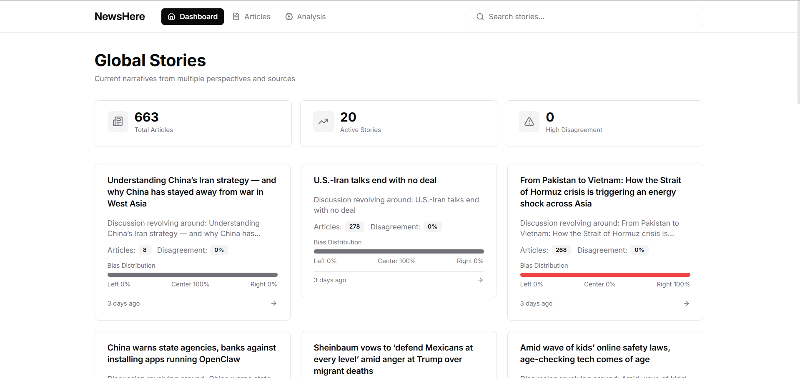
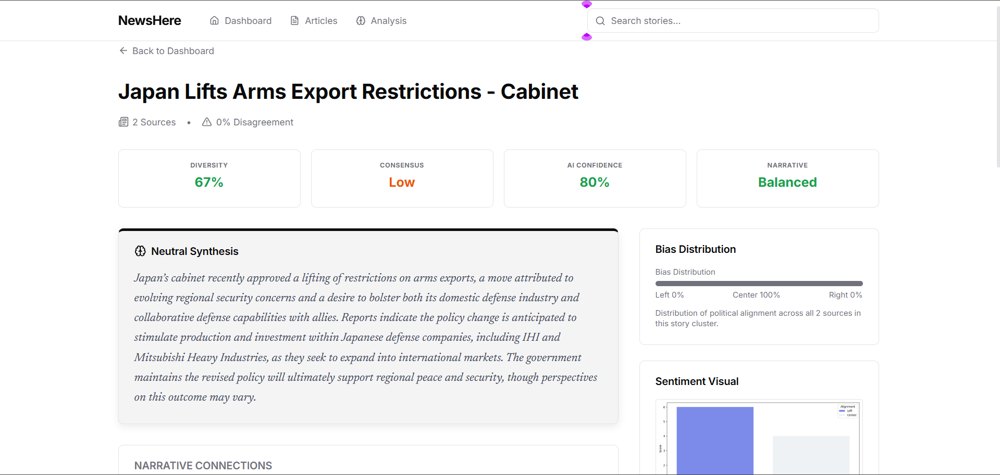
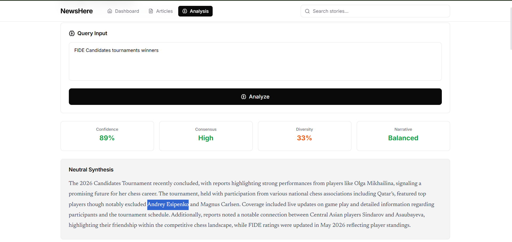
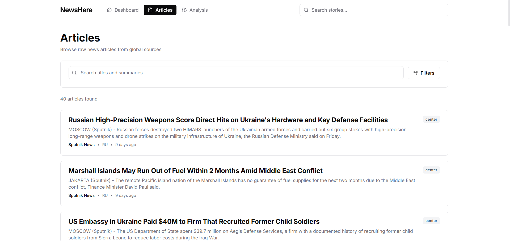

# 📰 NewsHere — AI-Powered News Aggregation & Bias Detection

An intelligent news aggregation platform that collects articles from **100+ global outlets** across 20+ countries, clusters them into unified **Stories** using vector embeddings, and uses **Google Gemini** to perform deep bias analysis — helping readers see through the noise and understand how different media outlets frame the same event.

---

## 🎯 Purpose / Motivation

Modern media is fragmented. A single event gets reported by dozens of outlets, each with a different angle, tone, and set of omissions. Readers end up in **echo chambers** without realizing it.

**NewsHere** was built to fix that by:

- **Aggregating** news from outlets across the entire political spectrum (Left, Center, Right) and from 20+ countries.
- **Clustering** articles about the same event into a single "Story" using semantic similarity — so you can compare coverage side-by-side.
- **Detecting bias** automatically with an AI agent that scores political alignment, emotional language, loaded terms, and missing viewpoints.
- **Synthesizing** a neutral, balanced summary from all sources — free from any single outlet's framing.

This is a personal project built to experiment with **LangGraph agent architectures**, **pgvector semantic search**, and **full-stack GenAI integration**.

---

## ✨ Features

| Feature | Description |
|---|---|
| **🌐 Global RSS Ingestion** | Polls 100+ feeds from outlets in India, US, UK, Canada, Japan, Brazil, Nigeria, and more |
| **📄 Full-Text Extraction** | Extracts clean article bodies using `newspaper3k`, with quality scoring and retry logic |
| **🧬 Semantic Clustering** | Groups related articles into Stories using `sentence-transformers` (384-dim) + `pgvector` cosine distance |
| **🤖 LangGraph AI Agent** | Multi-node analysis pipeline: query analysis → fetch → batch analysis → cross-examination → synthesis → visualization |
| **⚖️ Bias Scoring** | Per-article bias report: political alignment, emotional language, loaded terms, missing viewpoints, confidence score |
| **📊 Bias Visualization** | Auto-generated bar charts showing bias distribution across sources |
| **🔍 Hybrid Search** | Two-stage search: keyword filtering with semantic cross-validation, then pure semantic fallback |
| **🔄 GDELT Fallback** | When local articles are insufficient, the agent automatically queries the GDELT global event database |
| **📈 Story Improvement** | Identifies weaknesses in story coverage (bias imbalance, low diversity) and suggests articles to fill gaps |
| **🗞️ Interactive Dashboard** | React-based UI with story cards, bias bars, deep analysis views, and semantic search |

---

## 🛠️ Tech Stack

### Backend
- **Core**: [FastAPI](https://fastapi.tiangolo.com/), [PostgreSQL](https://www.postgresql.org/) with [pgvector](https://github.com/pgvector/pgvector)
- **AI/ML**: [Google Gemini](https://ai.google.dev/) (via `google-genai`), [LangGraph](https://github.com/langchain-ai/langgraph), `sentence-transformers`
- **Data**: `feedparser`, `newspaper3k`, `trafilatura`, `Pandas`, `Matplotlib`, `Seaborn`

### Frontend
- **Framework**: [React](https://reactjs.org/) (Vite + TypeScript)
- **Styling**: [Tailwind CSS](https://tailwindcss.com/), [Lucide React](https://lucide.dev/)

---

## 🖼️ Screenshots

>
> **Pages include:**
> - **Dashboard** — 
> - **Story Detail** — 
> - **Analyze** — 
> - **Browse Articles** — 

---

## ⚙️ Installation

### Prerequisites

- **Python** 3.9+
- **Node.js** 18+ & npm
- **PostgreSQL** 14+ with the [`pgvector`](https://github.com/pgvector/pgvector) extension
- A **Google Gemini API key** (free tier works)

### 1. Clone the Repository

```bash
git clone https://github.com/08Omkarmagar/Genai.git
cd Genai
```

### 2. Database Setup

```sql
CREATE DATABASE newsdb;
\c newsdb
CREATE EXTENSION IF NOT EXISTS vector;
```

### 3. Environment Variables

Create a `.env` file in the project root:

```env
DB_HOST=localhost
DB_PORT=5432
DB_NAME=newsdb
DB_USER=postgres
DB_PASSWORD=your_password
GOOGLE_API_KEY=your_gemini_api_key
```

### 4. Backend Setup

If you are using Conda (recommended):
```bash
conda env create -f environment.yml
conda activate Gai
```

Alternatively, using pip:
```bash
pip install -r requirements.txt
```

### 5. Frontend Setup

```bash
cd frontend/react
npm install
```

---

## 🚀 Usage

### Start the Backend

Open a **new terminal window**, activate your environment, and start the API:

```bash
conda activate Gai
cd backend
uvicorn main:app --reload --port 8000
```

The API will be available at `http://localhost:8000`. Visit `http://localhost:8000/docs` for the interactive Swagger UI.

### Start the Frontend

Open a **second terminal window** and start the React development server:

```bash
cd frontend/react
npm run dev
```

The dashboard will be available at `http://localhost:5173`.

### Typical Workflow

1. **Ingest articles** — Hit `POST /fetch/rss` to pull the latest news from all configured outlets.
2. **Extract bodies** — Hit `POST /fetch/body` to extract full article text.
3. **Explore stories** — Open the dashboard. Articles are automatically clustered into Stories.
4. **Analyze bias** — Click any Story to view its bias distribution, or use `POST /analyze` with a custom topic.
5. **Search** — Use the search bar for semantic search across all stories.

### API Endpoints

| Method | Endpoint | Description |
|---|---|---|
| `GET` | `/articles` | Paginated articles with filters (outlet, bias, country, date) |
| `GET` | `/articles/{id}` | Single article with full body |
| `GET` | `/stories` | List recent stories (or search with `?q=`) |
| `GET` | `/stories/{id}` | Story detail with linked articles |
| `GET` | `/stories/{id}/analysis` | AI deep analysis for a story (cached 24h) |
| `POST` | `/analyze` | Trigger deep analysis on a custom topic |
| `POST` | `/fetch/rss` | Trigger RSS collection from all outlets |
| `POST` | `/fetch/body` | Trigger full-text extraction for pending articles |
| `POST` | `/improve-stories` | Get story improvement suggestions |
| `GET` | `/outlets` | List all unique outlet names |
| `GET` | `/logs` | Fetch ingestion logs |

---

## 🧱 Project Structure

```text
├── backend/
│   ├── main.py                     # FastAPI routes & lifespan
│   ├── agent.py                    # LangGraph analysis agent (8-node pipeline)
│   ├── models.py                   # SQLAlchemy models (RSSArticle, Story, BiasReport, etc.)
│   ├── schemas.py                  # Pydantic schemas for agent responses
│   ├── database.py                 # Engine & session factory
│   ├── clustering_service.py       # Embedding generation & article clustering
│   ├── rss_fetcher.py              # RSS feed polling & deduplication
│   ├── rss_service.py              # RSS feed management
│   ├── body_fetcher.py             # Full-text extraction with quality scoring
│   ├── outlets.py                  # 100+ outlet configurations (Indian + Global)
│   ├── story_improvement_service.py # Weakness analysis & gap detection
│   ├── constants.py                # Stop words, page size
│   ├── utils.py                    # JSON parsing, dict merging helpers
│   └── logs/                       # Runtime logs
│
├── frontend/react/
│   ├── src/
│   │   ├── App.tsx                 # Router configuration
│   │   ├── config.ts               # API base URL
│   │   ├── components/
│   │   │   ├── HomePage.tsx        # Story cards grid with stats
│   │   │   ├── StoryPage.tsx       # Story detail + deep analysis view
│   │   │   ├── SearchPage.tsx      # Semantic search interface
│   │   │   ├── AnalysisDashboard.tsx # Custom topic analysis
│   │   │   ├── ArticlesList.tsx    # Paginated article browser
│   │   │   ├── BrowseArticles.tsx  # Single article view
│   │   │   ├── Fetching.tsx        # Data ingestion controls
│   │   │   ├── SearchBar.tsx       # Global search component
│   │   │   ├── Navbar.tsx          # Navigation bar
│   │   │   ├── Shared.tsx          # BiasBar, LoadingState, EmptyState
│   │   │   └── types.ts           # TypeScript interfaces
│   │   └── index.css               # Global styles
│   └── package.json
│
├── environment.yml                 # Conda environment configuration
├── requirements.txt                # Python dependencies
├── .env                            # Environment variables (not committed)
└── .gitignore
```

---

## 🧪 Testing

> **Note:** This project does not currently include a formal test suite. Contributions adding tests with **pytest** (backend) or **Vitest** (frontend) are welcome!
>
> To manually verify the pipeline:
> ```bash
> # 1. Start the server
> uvicorn backend.main:app --reload
>
> # 2. Trigger ingestion
> curl -X POST http://localhost:8000/fetch/rss
> curl -X POST http://localhost:8000/fetch/body
>
> # 3. Check articles were stored
> curl http://localhost:8000/articles?limit=5
>
> # 4. Check stories were clustered
> curl http://localhost:8000/stories
> ```
---
## 📄 License

> This project is licensed under the Apache License 2.0.  
> You are free to use, modify, and distribute this software in accordance with the license terms.
